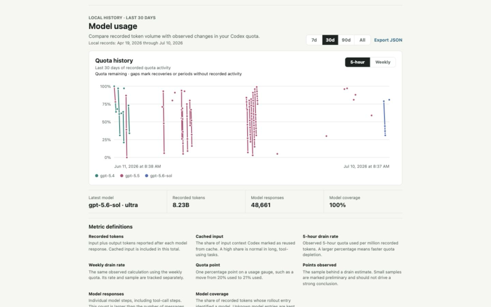
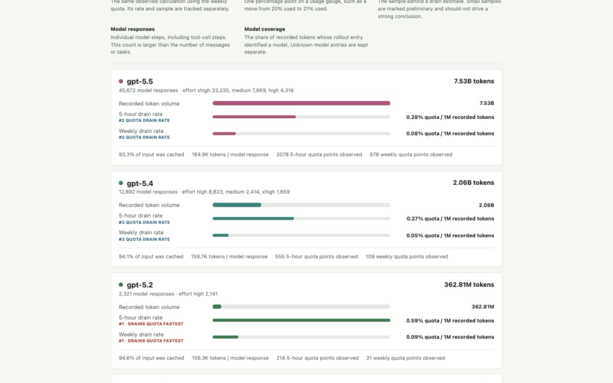
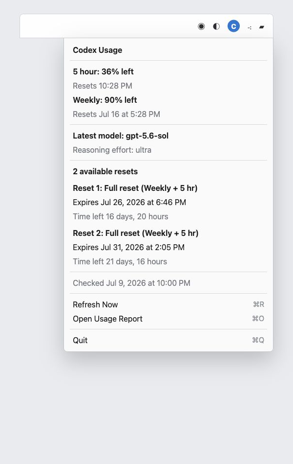

# Codex Usage and Resets

A read-only macOS menu-bar utility for Codex usage limits, reset-credit expiry, and local model/token statistics.

It adds a small `C` icon to the menu bar. The menu shows current 5-hour and weekly usage, the latest model, and every available reset. The browser report adds chronological quota history, per-model token and drain comparisons, selectable history ranges, and a sanitized JSON export.

> [!IMPORTANT]
> This is an independent utility, not an official OpenAI product. The Codex backend endpoints it reads are not a public stable API and may change.

## Screenshots







## Highlights

- Native macOS menu-bar app with no Dock icon or main window
- 5-hour and weekly usage remaining, with reset times
- Every available reset credit, its exact expiry, and a countdown from the snapshot time
- Latest local model and reasoning effort
- Per-model recorded input, cached input, output, and reasoning tokens
- 7-day, 30-day, 90-day, and all-history views in a self-contained HTML report, with `All` as the default
- Separate 5-hour and weekly quota-history views with model-colored lines, actual sample points, and meaningful gaps
- Per-model recorded-token, 5-hour drain, and weekly drain bars on one shared comparison scale
- Separate 5-hour and weekly rankings, with small samples clearly marked preliminary
- Sanitized JSON export for analysis or product feedback
- Calendar (`.ics`), terminal, and optional SwiftBar/xbar outputs
- No full Xcode installation required

## Quick Start

1. Download or clone the repository on a Mac where Codex Desktop is already signed in.
2. Double-click `build-codex-menubar-app.command`.
3. Open `Codex Usage.app`.
4. Click the small `C` icon in the macOS menu bar.

The first model-history report may take several seconds while it indexes existing local Codex rollout files. Later reports are incremental and only read newly appended data.

If `swiftc` is missing, install Apple's Command Line Tools:

```bash
xcode-select --install
```

Full Xcode is not required.

## Usage Report

Choose **Open Usage Report** from the menu-bar menu, or run:

```bash
/usr/bin/python3 codex-reset-expiry.py --html codex-usage-report.html
open codex-usage-report.html
```

The generated report is self-contained. Its `7d`, `30d`, `90d`, and `All` controls work without leaving a terminal process running.

Each range changes the model totals **and** the Quota history chart directly beneath the range controls. Longer ranges are downsampled for readability while preserving the selected period, quota-recovery gaps, and model colors.

The chart starts at 100% quota remaining and moves downward as quota is used. Switch between **5-hour** and **Weekly** to inspect their separate chronological histories. Lines connect real account-wide gauge samples; gaps mark quota recovery or periods without recorded activity rather than inventing a continuous trend.

Those ranges describe the Codex records still present on the Mac, not the lifetime of the account. The report prints the earliest and latest local record it found. If only 82 days are available locally, for example, `90d` and `All` will correctly show the same totals while `7d` and `30d` still use their own cutoffs.

For a live local report that refreshes every five minutes:

```bash
/usr/bin/python3 codex-reset-expiry.py --serve --open
```

The live server binds only to `127.0.0.1`.

## Metric Guide

| Metric | Meaning |
| --- | --- |
| Recorded tokens | Input plus output tokens in Codex's local per-response records. Cached input is included. |
| Cached input | The share of input context that Codex marked as reused from cache. A high share is normal in long tool-using tasks. |
| 5-hour drain rate | Positive changes in the five-hour usage gauge divided by recorded tokens attributed to that model, shown as `% quota / 1M recorded tokens`. |
| Weekly drain rate | The same observed calculation using the weekly gauge. It has its own rate and sample size. |
| Drain bar length | All 5-hour and Weekly bars use one shared scale. A longer bar means faster observed quota depletion per recorded token. |
| Points observed | The sample behind a cost estimate. Five points means changes such as 20% to 25%, not five hours or five resets. |
| Model responses | Individual model steps, including tool-call steps. This is not the number of user messages or tasks. |
| Model coverage | The share of recorded tokens whose rollout entry identified a model. |

The quota percentage is rounded and account-wide. Model attribution is therefore an observed estimate, especially when tasks overlap or Codex is used on another device. Rankings are calculated separately for the 5-hour and Weekly gauges, and samples below 25 observed points are marked preliminary. See [docs/METRICS.md](docs/METRICS.md) for the calculation and limitations.

## JSON Export

Use **Export JSON** in the report, or run:

```bash
/usr/bin/python3 codex-reset-expiry.py \
  --model-json codex-model-usage-report.json \
  --quiet
```

The export contains aggregate model/token statistics, separate 5-hour and weekly quota-cost objects, and quota timeline points. It does not contain prompts, messages, task titles, repository paths, authentication tokens, or conversation content.

## Privacy and Safety

The utility uses two local data sources:

1. `~/.codex/auth.json` to authenticate read-only requests for current usage and reset-credit details.
2. `~/.codex/sessions` and `~/.codex/archived_sessions` to read model names, token counters, and quota snapshots already written by Codex.

The incremental history cache is stored at:

```text
~/.codex/codex-usage-reset-history-v1.json.gz
```

It is created with mode `0600` and retains only timestamps, model/effort labels, token counters, and quota snapshots. No conversation text is copied into the cache.

The project calls these read-only endpoints:

```text
https://chatgpt.com/backend-api/wham/rate-limit-reset-credits
https://chatgpt.com/backend-api/wham/usage
```

There is no reset-redemption request in this project. Redeem resets only in the official Codex app. See [SECURITY.md](SECURITY.md) for the security model and verification commands.

## Requirements

- macOS 13 or newer for the native menu-bar app
- Codex Desktop signed in on the same Mac
- Python 3 at `/usr/bin/python3`
- Apple Command Line Tools for building the native app

The default build targets the current Mac architecture. To attempt a universal Intel/Apple Silicon build:

```bash
UNIVERSAL=1 ./build-codex-menubar-app.command
```

## Other Commands

Terminal report:

```bash
/usr/bin/python3 codex-reset-expiry.py --pretty
```

Calendar reminders (72, 24, and 6 hours before expiry by default):

```bash
/usr/bin/python3 codex-reset-expiry.py --ics codex-reset-expiry.ics
```

Optional SwiftBar/xbar plugin:

```bash
brew install --cask swiftbar
./install-codex-menubar-widget.command
```

## Development

Run the complete local check:

```bash
make check
```

Or run each check separately:

```bash
/usr/bin/python3 -m unittest -v test_codex_reset_expiry.py
swiftc -typecheck CodexUsageMenuBar.swift
make safety
```

See [CONTRIBUTING.md](CONTRIBUTING.md) and [CHANGELOG.md](CHANGELOG.md).

## Troubleshooting

**The app is running, but the `C` icon is missing.** Your menu bar may be full or a menu-bar manager may be hiding it. Close or hide another status item, then reopen `Codex Usage.app`.

**The report takes a while the first time.** The initial pass indexes existing rollout files. Later runs use byte offsets from the private incremental cache.

**`90d` and `All` show the same totals.** This is expected when fewer than 90 days of Codex records remain on the Mac. Check the **Local records** date span shown above the range controls.

**macOS blocks a downloaded `.command` file.** In Finder, Control-click it and choose **Open**, or run the command from Terminal.

**Usage or reset data stopped loading.** The read-only backend endpoints are unofficial and may have changed. Open an issue with the error text, but never attach `~/.codex/auth.json`.

## License

[MIT](LICENSE)
